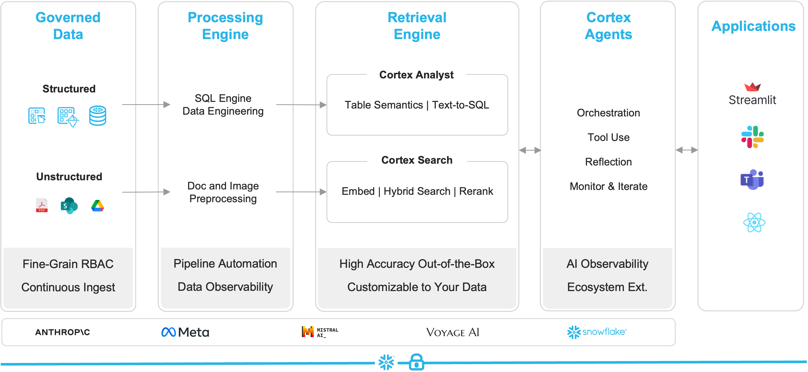
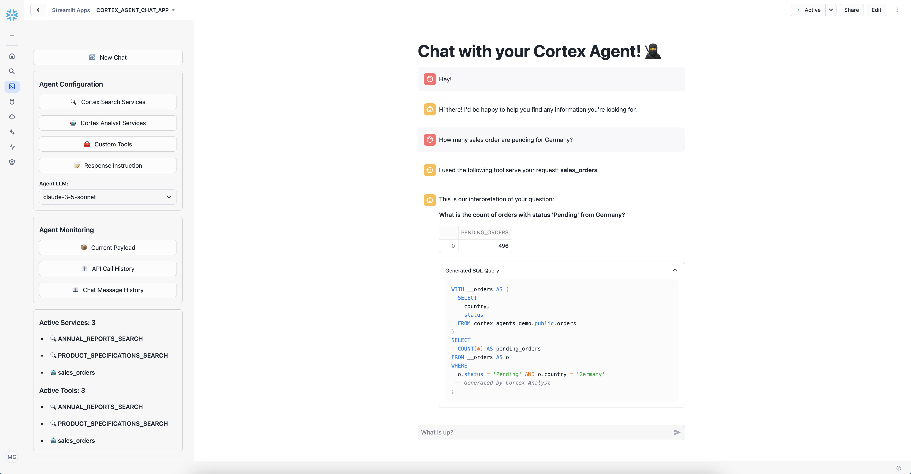

# Cortex Agents in Snowflake

## Overview
This repository provides a beginner-friendly demonstration of the power of Cortex Agents in Snowflake. The demo is structured as a Jupyter Notebook, guiding users through the setup of Cortex Search and Cortex Analyst Services. By combining multiple services, we then build a Cortex Agent capable of delivering accurate responses based on PDF documents and structured data stored across multiple Snowflake tables.

## What are Cortex Agents?
Cortex Agents orchestrate both structured and unstructured data sources to deliver actionable insights. They:
- **Plan tasks**, selecting the right tools to execute them.
- **Use Cortex Analyst** for structured data (generating SQL queries).
- **Use Cortex Search** for unstructured data (extracting insights from documents and text).
- **Generate responses** using LLMs based on enterprise data.



## Cortex Agents Workflow
Cortex Agents follow a structured approach to problem-solving:
1. **Planning:** Determine the best approach to answer a user query.
2. **Explore Options:** Resolve ambiguous queries by considering different interpretations.
3. **Split into Subtasks:** Decompose complex requests into manageable parts.
4. **Route Across Tools:** Select and utilize the right tools for the task.
5. **Tool Use:** Execute queries via Cortex Analyst and Cortex Search.
6. **Reflection:** Evaluate results, refine the process, and generate a final response.
7. **Monitor & Iterate:** Continuously improve the agent’s performance.

## Demo Features
- **End-to-End Setup:** Step-by-step instructions to configure Cortex Search and Cortex Analyst.
- **Practical Examples:** Hands-on implementation showcasing structured and unstructured data integration.
- **Agent API Usage:** Learn how to query the Cortex Agents API using REST calls from within a Streamlit App running in Snowflake.
- **Streamlit Agent App:** Configure easily which Services your Agent should use and let the Agent figure out the right approach to answer your questions.

## Demo Video
This is the App you will build:
[](https://www.youtube.com/watch?v=XwmynoLVUqw)

# Example Questions for the app 
This assumes you selected relevant services:
* ANNUAL_REPORTS_SEARCH
* semantic_models/sales_orders.yaml

### Questions for Structured Data
`What was the order revenue per month for steel for my customer Delta?`
`Give me the current aggregated status of orders from my customer Gamma that contain Aluminium.`
### Questions for Structured Data
`What were the latest AI innovations from Googol in 2024?`
This uses a single text chunk from a single document (**easy**)
`What was the net profit for Delta in 2024 and which people were part of the board?`
This uses two chunks from a single document (**medium**)
`What was the combined net profit for Googol and Delta in 2024?`
This uses two chunks from two documents and combines the results (**hard**)

## Prerequisites
- A Snowflake Account
- 5 Minutes time  

Here you can get a free [Snowflake Trial Account](https://signup.snowflake.com/).

## Setup
All you need to do is to execute the following SQL statements in your Snowflake Account.  

```sql
USE ROLE ACCOUNTADMIN;

-- Create a warehouse
CREATE WAREHOUSE IF NOT EXISTS COMPUTE_WH WITH WAREHOUSE_SIZE='X-SMALL';

-- Create a fresh Database
CREATE OR REPLACE DATABASE CORTEX_AGENTS_DEMO;

-- Create the API integration with Github
CREATE OR REPLACE API INTEGRATION GITHUB_INTEGRATION_CORTEX_AGENTS_DEMO
    api_provider = git_https_api
    api_allowed_prefixes = ('https://github.com/michaelgorkow/')
    enabled = true
    comment='Git integration with Michael Gorkows Github Repository.';

-- Create the integration with the Github demo repository
CREATE GIT REPOSITORY GITHUB_REPO_CORTEX_AGENTS_DEMO
	ORIGIN = 'https://github.com/michaelgorkow/snowflake_cortex_agents_demo' 
	API_INTEGRATION = 'GITHUB_INTEGRATION_CORTEX_AGENTS_DEMO' 
	COMMENT = 'Github Repository from Michael Gorkow with a demo for Cortex Agents.';

-- Create stage for documents and semantic models
CREATE OR REPLACE STAGE DOCUMENTS
  DIRECTORY = (ENABLE = TRUE)
  ENCRYPTION = ( TYPE = 'SNOWFLAKE_SSE' );
  
CREATE OR REPLACE STAGE SEMANTIC_MODELS
  DIRECTORY = (ENABLE = TRUE)
  ENCRYPTION = ( TYPE = 'SNOWFLAKE_SSE' );
  
CREATE OR REPLACE STAGE STREAMLIT_APP
  DIRECTORY = (ENABLE = TRUE)
  ENCRYPTION = ( TYPE = 'SNOWFLAKE_SSE' );
  
-- Fetch most recent files from Github repository
ALTER GIT REPOSITORY GITHUB_REPO_CORTEX_AGENTS_DEMO FETCH;

-- Copy Files into to stages
COPY FILES
  INTO @DOCUMENTS
  FROM @CORTEX_AGENTS_DEMO.PUBLIC.GITHUB_REPO_CORTEX_AGENTS_DEMO/branches/main/documents/
  PATTERN='.*[.]pdf';
ALTER STAGE DOCUMENTS REFRESH;

COPY FILES
  INTO @SEMANTIC_MODELS
  FROM @CORTEX_AGENTS_DEMO.PUBLIC.GITHUB_REPO_CORTEX_AGENTS_DEMO/branches/main/semantic_models/
  PATTERN='.*[.]yaml';
ALTER STAGE SEMANTIC_MODELS REFRESH;

COPY FILES
  INTO @STREAMLIT_APP
  FROM @CORTEX_AGENTS_DEMO.PUBLIC.GITHUB_REPO_CORTEX_AGENTS_DEMO/branches/main/agent_app/;
ALTER STAGE STREAMLIT_APP REFRESH;

-- Create and execute demo notebook (you can check it out later)
CREATE OR REPLACE NOTEBOOK CORTEX_AGENTS_DEMO.PUBLIC.CORTEX_AGENTS_SETUP FROM '@CORTEX_AGENTS_DEMO.PUBLIC.GITHUB_REPO_CORTEX_AGENTS_DEMO/branches/main/' MAIN_FILE = 'CORTEX_AGENTS_SETUP.ipynb' QUERY_WAREHOUSE = compute_wh;
ALTER NOTEBOOK CORTEX_AGENTS_DEMO.PUBLIC.CORTEX_AGENTS_SETUP ADD LIVE VERSION FROM LAST;
EXECUTE NOTEBOOK CORTEX_AGENTS_SETUP();

-- Create Streamlit App
CREATE OR REPLACE STREAMLIT CORTEX_AGENT_CHAT_APP
    ROOT_LOCATION = '@CORTEX_AGENTS_DEMO.PUBLIC.STREAMLIT_APP'
    MAIN_FILE = '/app.py'
    QUERY_WAREHOUSE = COMPUTE_WH;
```

## Objects you create in your Account
| **Name**            | **Type**       | **Description**                                                       |
|---------------------|----------------|-----------------------------------------------------------------------|
| CORTEX_AGENTS_DEMO  | Databse        | Everything in this demo goes in here.                                 |
| CUSTOMER_ORDERS     | Table          | Stores customers and their orders                                     |
| ORDERS              | Table          | Details of customer orders                                            |
| PRODUCTS            | Table          | Details of products                                                   |
| RAW_TEXT            | Table          | Extractions from PDF (raw)                                            |
| CHUNKED_TEXT        | Table          | Chunks of RAW_TEXT                                                    |
| DOCUMENTS           | Stage          | Stage to store PDF Documents                                          |
| SEMANTIC_MODELS     | Stage          | Stage to store Semantic Model Files (YAML)                            |
| CORTEX_AGENTS_SETUP | Notebook       | Notebook showing how to setup Services for Cortex Agent               |
| sales_orders.yaml   | Semantic Model | Input for Cortex Analyst to generate SQL Queries for Sales Order Data |
| CORTEX_AGENTS_CHAT_APP   | Streamlit App | Chatbot Application to configure Cortex Agents and talk with your structured and unstructured data. |

To fully understand how the Agent works, I highly recommend to check out the Notebook that sets up the services the Agent is using.

## Supported Models
Cortex Agents support the following LLMs:
- `llama3.3-70b`
- `mistral-large2`
- `claude-3-5-sonnet`

## Availability
Cortex Agents are currently available in the following Snowflake regions:
- **AWS:** US West 2 (Oregon), US East 1 (Virginia), Europe Central 1 (Frankfurt), Europe West 1 (Ireland), AP Southeast 2 (Sydney), AP Northeast 1 (Tokyo)
- **Azure:** East US 2 (Virginia), West Europe (Netherlands)

For more details, check out Snowflake’s official documentation:
- [Cortex Agents](https://docs.snowflake.com/en/user-guide/snowflake-cortex/cortex-agents)
- [Cortex Search](https://docs.snowflake.com/en/user-guide/snowflake-cortex/cortex-search/cortex-search-overview)
- [Cortex Analyst](https://docs.snowflake.com/user-guide/snowflake-cortex/cortex-analyst)

## Kudos  
A huge shoutout to my colleague [Tom Christian](https://github.com/sfc-gh-tchristian) for elevating the Streamlit app to the next level! 🚀   
  
